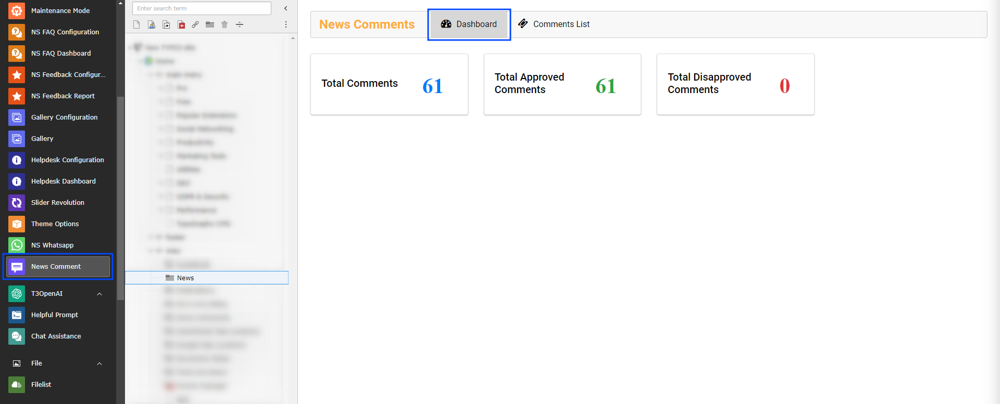
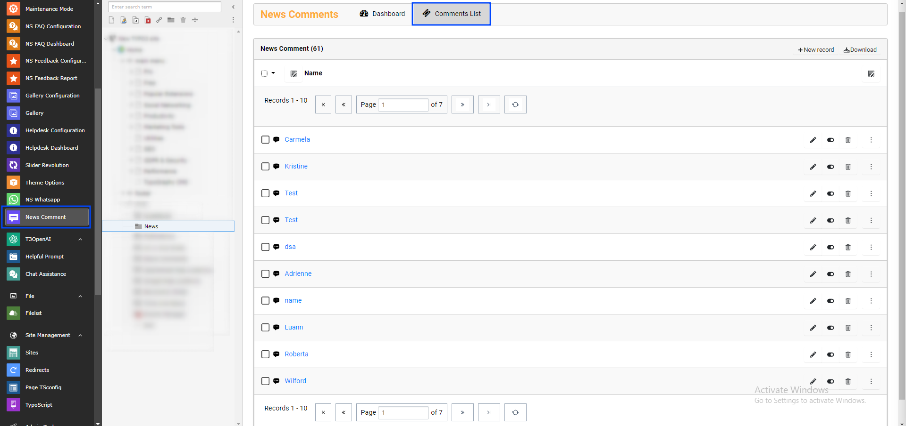

..  include:: /Includes.rst.txt

..  _backend-module:

=============================
News Comment Backend Module
=============================

If "Set Approval by admin" is checked in Constants then comments added by visitors will not be displayed automatically on the News page. Admin can approve comments from the backend module.

Admin can approve comments by following these steps:

**Step 1** Select News Module from Sidebar

**Step 2** Select "News" Folder where News are added

You'll see two tabs: Dashboard and Comment List. Let's check how each works.

Dashboard
=========

In the Dashboard you'll see the total number of comments, total approved comments and total disapproved comments.

Dashboard Features:
- **Total Comments** - Overview of all comments in the system
- **Approved Comments** - Number of comments that are live on the website
- **Pending Comments** - Comments waiting for admin approval
- **Statistics** - Quick overview of comment activity

Comments List
=============

In this section, admin can approve/disapprove and delete comments.

Comment Management Features:

**Approval Actions:**
- **Approve** - Make comments visible on the frontend
- **Disapprove** - Hide comments from public view
- **Delete** - Permanently remove comments from the system

**Comment Information:**
- Author name and email
- Comment content preview
- Associated news article
- Submission date and time
- Current approval status

**Bulk Operations:**
- Select multiple comments for batch processing
- Bulk approve or disapprove selected comments
- Mass delete unwanted comments

Moderation Workflow
===================

1. **New Comment Submitted** - Visitor posts comment on news article
2. **Admin Notification** - Email notification sent to administrator
3. **Review Process** - Admin reviews comment in backend module
4. **Approval Decision** - Admin approves, disapproves, or deletes comment
5. **Frontend Display** - Approved comments appear on news page

Best Practices
===============

*   **Regular Monitoring** - Check the backend module regularly for new comments
*   **Quick Response** - Approve legitimate comments promptly to encourage engagement
*   **Clear Policies** - Establish clear comment moderation guidelines
*   **Spam Protection** - Use the built-in spam protection features
*   **Community Guidelines** - Communicate comment policies to users

That's it! Now you can enjoy managing comments from your website visitors.
