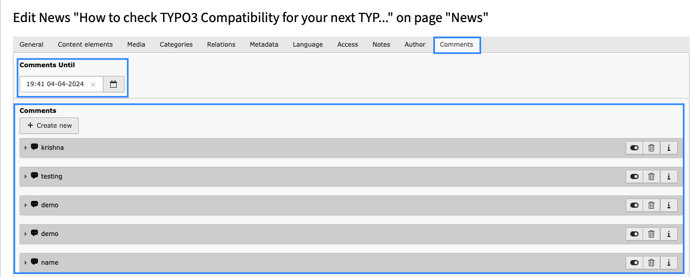
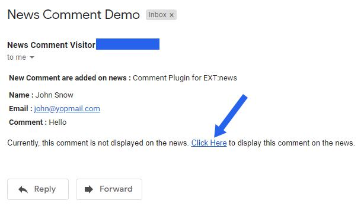

..  include:: /Includes.rst.txt

..  _comment-moderation:

==================
Comment Moderation
==================

Manage comment approval process, moderation workflow and email-based approval system.

Comment Moderation Overview
===========================

If "Set Approval by admin" is checked in Constants then comments added by visitors will not be displayed automatically on the News page. Admin needs to approve these comments to display on the News page.

**Comment Deadline Configuration:**
Users are allowed to leave comments up until the specified date. For example, if admin sets any date (e.g., 12:00 01-01-2030), users can comment until that date and time. After that date, users will not be able to add comments to that news.

Approval Methods
================

Admin can approve comments using two methods:

1. Approve Comment from Backend
-------------------------------

All comments added to any News are stored in the Comments tab of the News record in backend. By default, comments are disabled and thus not displayed on the News page. Once Admin enables the comment in the News record, that comment will be visible on the News page.

**Backend Approval Process:**
1. Navigate to the News module in TYPO3 backend
2. Select the specific news record
3. Go to the "Comments" tab
4. Review the pending comments
5. Enable/disable comments as needed
6. Save the record

2. Approve Comment from Email
-----------------------------

If Email Configuration is set in constants then Admin will get an email for every comment posted. Admin can approve comments from the link available at the bottom of the email.

**Email Approval Process:**
1. Receive email notification for new comment
2. Review comment content in email
3. Click approval link at bottom of email
4. Comment is automatically approved and made live

Moderation Workflow
===================

**Step 1: Comment Submission**
- Visitor submits comment on news article
- Comment is stored in database with "pending" status
- System checks moderation settings

**Step 2: Admin Notification**
- If email notifications are enabled, admin receives email
- Email contains comment details and approval links
- Backend module shows new pending comments

**Step 3: Review Process**
- Admin reviews comment content
- Checks for spam, inappropriate content, or policy violations
- Decides to approve, reject, or request modifications

**Step 4: Approval Action**
- Approve via backend module or email link
- Comment becomes visible on frontend
- Optional: Send notification to commenter

**Step 5: Publication**
- Approved comments appear on news page
- Comments integrate with existing discussion threads
- Reply functionality becomes available

Moderation Features
===================

**Bulk Operations:**
- Approve multiple comments simultaneously
- Bulk reject spam or inappropriate comments
- Mass delete unwanted content

**Content Filtering:**
- Automatic spam detection
- Keyword filtering options
- IP-based restrictions

**Time-based Controls:**
- Set comment deadlines for news articles
- Automatic comment closing after specified period
- Time-based approval workflows

**User Management:**
- Track commenter information
- Block specific users or email addresses
- Whitelist trusted commenters

Best Practices
==============

*   **Regular Monitoring** - Check for pending comments regularly
*   **Clear Guidelines** - Establish and communicate comment policies
*   **Quick Response** - Approve legitimate comments promptly
*   **Consistent Standards** - Apply moderation rules consistently
*   **User Communication** - Inform users about comment policies
*   **Spam Protection** - Use captcha and filtering tools effectively

That's it! Now you can enjoy managing comments from your website visitors with full control over the moderation process.
