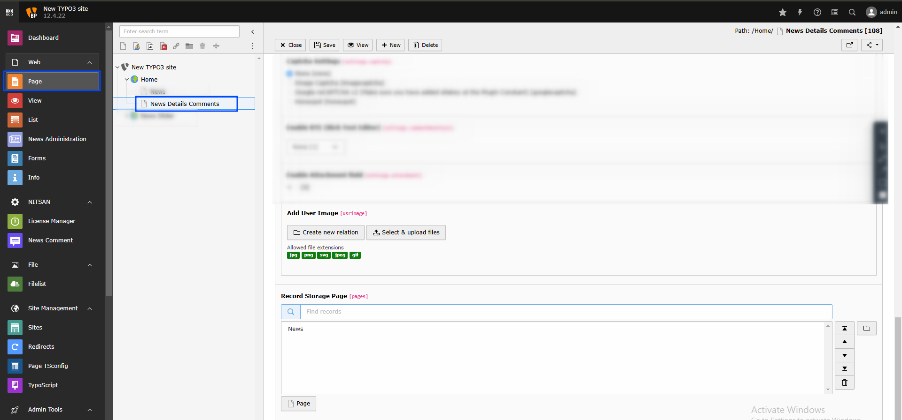

..  include:: /Includes.rst.txt

..  _comment-plugin-settings:

=======================
Comment Plugin Settings
=======================

Setup comment plugin with captcha options, form settings and display configurations for your news pages.

Adding the Comment Plugin
==========================

You can add the News Comment plugin from the "Add Element" wizard.

Once added, configure the settings for the Comment plugin as follows:

Main Configuration
==================

**Layout and Display Options:**

- **Form Layout Variations** - Defines the overall layout style of the form
- **Hide/Show Other Fields** - Toggles additional fields when the comment box is clicked
- **Form Error Variations** - Sets the style for displaying form error messages
- **Comments Layout Variations** - Controls the layout style of the displayed comments
- **User Profile Position** - Determines the position of the user profile display

**Styling and Appearance:**

- **User Profile Shape** - Specifies the shape of the user profile display
- **Dark Mode** - Enables dark mode for the form
- **Primary Color** - Sets the main color for form elements
- **Text Color** - Determines the color of the form's text
- **Border Color** - Sets the border color of the form fields
- **Form Background Color** - Specifies the form's background color
- **Sticky Comment Count** - Shows the number of comments on the sticky comment icon
- **Language Fallback** - Helps display comments in different site languages
- **Custom Date Format** - Enables custom date formatting for comments

**Date and Rating Settings:**

..  figure:: ../Images/comment_plugin3.png
    :alt: Comment Plugin - Main Configuration 3

- **Date Format** - Selects the format for displaying dates (e.g., F j, Y or Y-m-d)
- **Time Format** - Sets the display format for time (e.g., ga or H)
- **Disabled Like Option** - Hides the like/unlike buttons on comments
- **Enable Form Rating Option** - Allows users to rate the form itself
- **Enable Comment Rating Option** - Enables rating for individual comments

Captcha Settings
================

Configure CAPTCHA to prevent spam, with the following options:

**None**
Disables CAPTCHA protection.

**Image Captcha**
Displays an image-based CAPTCHA for users.

If using the free version with CAPTCHA enabled, the image CAPTCHA will appear in the comment form.

..  note::

    If you select Image Captcha, you need to rename `_.htaccess` to `.htaccess` in the folder `/typo3conf/ext/ns_news_comments/Resources/Private/`.

**Google reCAPTCHA v2**
Shows Google reCAPTCHA v2. Ensure you add your site key in the plugin constants.

..  figure:: ../Images/google-captcha.jpeg
    :alt: Google reCAPTCHA Example

Advanced Features
=================

**Rich Text and Attachments:**
- **Enable RTE (Rich Text Editor)** - Allows rich text editing in the comment box
- **Enable Attachment Field** - Adds an attachment upload option to the comment form
- **Add User Image** - Allows users to upload a profile image with their comments

**Storage Configuration:**
- **Record Storage Page** - Defines the page where form records will be stored

Plugin Features
===============

*   **Multiple Layout Options** - Choose from various form and comment layouts
*   **Customizable Styling** - Complete control over colors, fonts, and appearance
*   **Spam Protection** - Multiple captcha options including Google reCAPTCHA
*   **Rich Content Support** - RTE editor and file attachment capabilities
*   **User Profiles** - Profile images and user information display
*   **Responsive Design** - Mobile-friendly across all devices
*   **Multi-language Support** - Language fallback and localization
*   **Rating System** - Like/unlike and rating functionality
