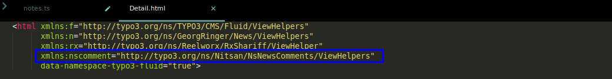
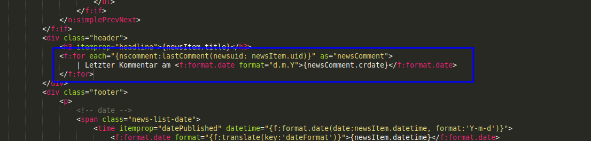
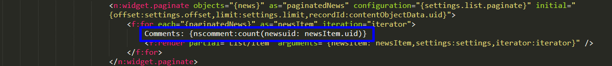
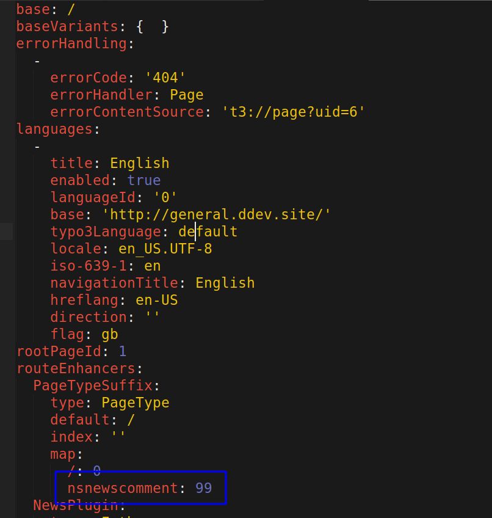

..  include:: /Includes.rst.txt

..  _for-developers:

==============
For Developers
==============

Developer documentation including ViewHelpers, API usage and integration examples for custom implementations.

ViewHelpers
===========

We have added a few ViewHelpers with this extension to get the date of last comment in a News and to get count of number of comments in each News.

For this, you have to add a Namespace of ViewHelper:

..  code-block:: html

    xmlns:nscomment="http://typo3.org/ns/Nitsan/NsNewsComments/ViewHelpers"

Get Date of Last Comment in a News
===================================

To get the date of last comment in a news, add the following code:

..  code-block:: html

    <f:for each="{nscomment:lastComment(newsuid: newsItem.uid)}" as="newsComment">
     | Last Comment on <f:format.date format="d.m.Y">{newsComment.crdate}</f:format.date>
    </f:for>

**Usage Example:**
This ViewHelper is useful for displaying when the last comment was posted on a news article, helping visitors understand the recency of discussion.

Get Count of Comments in a News
================================

To get the count of comments in a news, add the following code in List.html:

..  code-block:: html

    Comments: {nscomment:count(newsuid: newsItem.uid)}

**Usage Example:**
Display the total number of comments on each news article in list views, helping users identify popular or discussed articles.

..  note::

    Above ViewHelpers are supported in TYPO3 v8, v9 & v10 only.

Routing in TYPO3 9 & 10+
=========================

Since version 9.5, TYPO3 supports speaking URLs and if you have used the typeNum for any Ajax related work then you also need to add **routeEnhancers** like **routeEnhancers > PageTypeSuffix > map > nsnewscomment: 99** in your site configuration.

..  code-block:: yaml

    routeEnhancers:
      PageTypeSuffix:
        type: PageType
        default: /
        index: ''
        map:
          /: 0
          nsnewscomment: 99

API Integration
===============

**Comment Model:**
The extension provides a Comment model that can be used for custom implementations:

..  code-block:: php

    use Nitsan\NsNewsComments\Domain\Model\Comment;
    use Nitsan\NsNewsComments\Domain\Repository\CommentRepository;

**Repository Usage:**
Access comment data programmatically:

..  code-block:: php

    $commentRepository = GeneralUtility::makeInstance(CommentRepository::class);
    $comments = $commentRepository->findByNewsUid($newsUid);

Custom Templates
================

**Template Override:**
You can override the default templates by copying them to your site package:

- Copy from: `EXT:ns_news_comments/Resources/Private/Templates/`
- Copy to: `EXT:your_extension/Resources/Private/Templates/NsNewsComments/`

**Partial Override:**
Override specific partials for custom styling:

- Copy from: `EXT:ns_news_comments/Resources/Private/Partials/`
- Copy to: `EXT:your_extension/Resources/Private/Partials/NsNewsComments/`

**Layout Override:**
Customize the overall layout structure:

- Copy from: `EXT:ns_news_comments/Resources/Private/Layouts/`
- Copy to: `EXT:your_extension/Resources/Private/Layouts/NsNewsComments/`

JavaScript Integration
======================

**Custom JavaScript:**
Add custom JavaScript functionality:

..  code-block:: javascript

    // Example: Custom comment submission handler
    document.addEventListener('DOMContentLoaded', function() {
        const commentForm = document.querySelector('.ns-comment-form');
        if (commentForm) {
            commentForm.addEventListener('submit', function(e) {
                // Custom validation or processing
            });
        }
    });

**AJAX Integration:**
The extension supports AJAX comment submission for enhanced user experience.

CSS Customization
=================

**Custom Styling:**
Override default styles by adding CSS to your theme:

..  code-block:: css

    /* Custom comment styling */
    .ns-comment-wrapper {
        /* Your custom styles */
    }
    
    .ns-comment-form {
        /* Form styling */
    }
    
    .ns-comment-item {
        /* Individual comment styling */
    }

Extension Points
================

**Hooks:**
The extension provides several hooks for custom functionality:

- Pre-comment submission processing
- Post-comment approval actions
- Custom validation rules
- Email template modifications

**Signals:**
Use PSR-14 events for advanced integrations:

- CommentCreatedEvent
- CommentApprovedEvent
- CommentRejectedEvent

Best Practices
==============

*   **Performance** - Use caching for comment counts and lists
*   **Security** - Validate and sanitize all user input
*   **Accessibility** - Ensure comment forms are screen reader friendly
*   **SEO** - Structure comments for search engine optimization
*   **Testing** - Write unit tests for custom ViewHelpers and functionality
