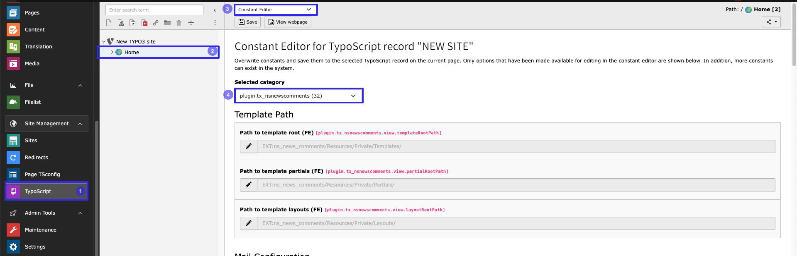
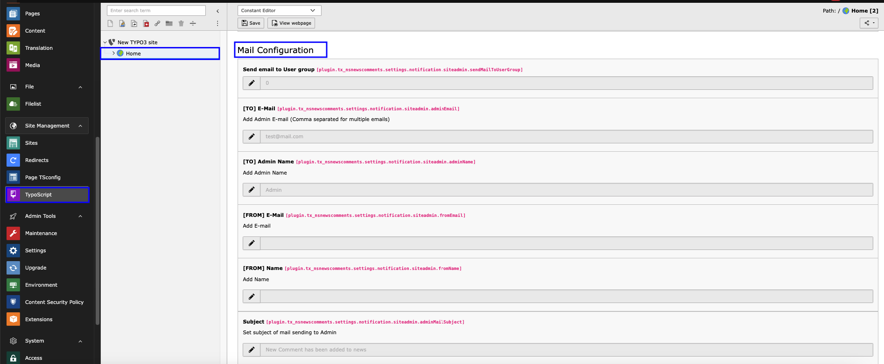
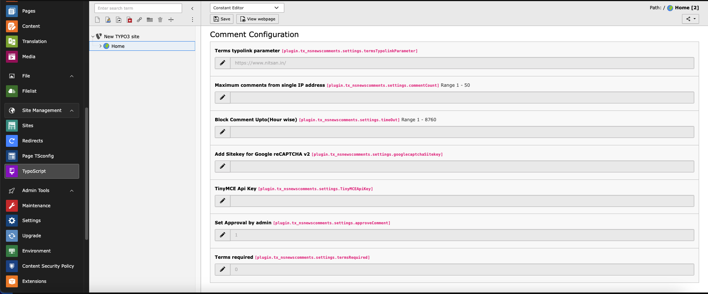
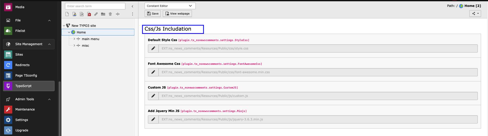
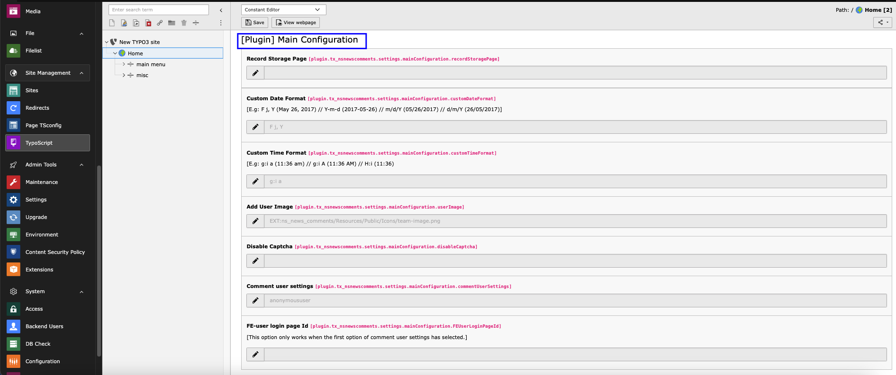
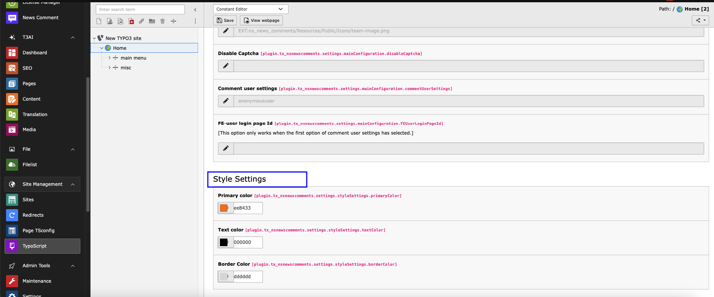

..  include:: /Includes.rst.txt

..  _global-configuration:

====================
Global Configuration
====================

Configure global settings for the comment system through the Constants Editor.

Default Settings from Constants
===============================

First of all, configure default settings in Constants:

1. Go to TypoScript.
2. Select root page.
3. Select Constant Editor from drop-down.
4. Select Constant Editor > PLUGIN.TX_NSNEWSCOMMENTS.

Email Configuration
===================

Here, you can configure the emails received by Admin when visitors add comments.

**Email Settings:**

- **Enable Mail** - Check this checkbox to enable email to admin whenever any comment is posted
- **[TO] E-Mail** - Set the email address where email should be sent (generally admin's email)
- **[TO] Admin Name** - Set the admin name
- **[FROM] E-Mail** - Set from email for email sent to admin
- **[FROM] Name** - Set sender name for email sent to admin
- **Subject** - Set email subject

Comment Configuration
=====================

**Comment Settings:**

- **Terms typolink parameter** - Set the Terms page URL for terms checkbox
- **Maximum Comments from single IP address** - Set maximum allowed comments from single IP address for spam protection
- **Block Comment Up to (Hour wise)** - Block comments for defined time interval to protect site from unnecessary comments
- **Add Sitekey for Google reCAPTCHA v2** - Set Google reCaptcha v2 sitekey. Get it from: https://www.google.com/recaptcha/admin/create
- **TinyMCE API key** - Add TinyMCE API key for RTE Style. Reference: https://www.tiny.cloud/blog/how-to-get-tinymce-cloud-up-in-less-than-5-minutes/
- **Set Approval by admin** - If checked, only admin-enabled comments will be published. Unchecked means all comments display immediately
- **Terms required** - Check to add required Terms checkbox in comment form

CSS/JS Settings
================

Here, you can set your own CSS & JS for this extension.

**Custom Styling:**
- **Custom CSS** - Add your own CSS styles for comment display
- **Custom JavaScript** - Include custom JavaScript for enhanced functionality
- **Override Defaults** - Replace default styling with your theme styles

Main Configuration
==================

Configure core functionality and behavior settings.

Style Settings
==============

Here you can set default settings for the Comments plugin. If any field in the Comment plugin is not defined, values set here will be used.

**Default Plugin Settings:**
- Form styling options
- Display preferences
- Layout configurations
- Responsive behavior settings

Security Features
=================

**Spam Protection:**
- IP address limiting
- Time-based comment blocking
- Google reCAPTCHA integration
- Admin approval workflow

**Content Filtering:**
- Terms and conditions requirement
- Comment content validation
- User information verification

**Performance:**
- Optimized database queries
- Efficient caching mechanisms
- Minimal frontend JavaScript footprint
