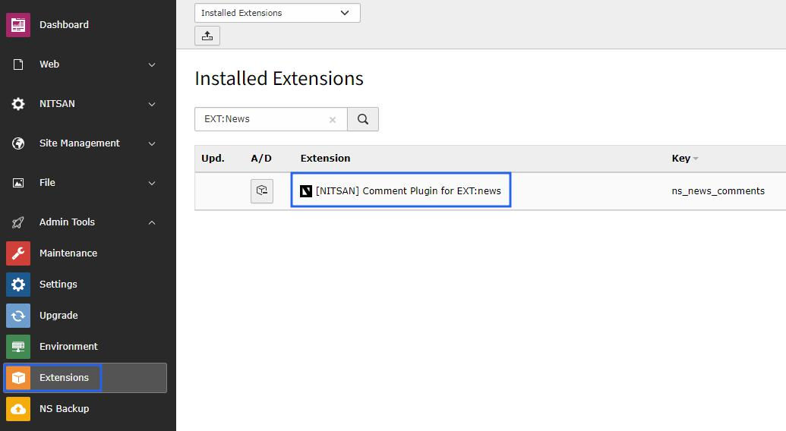
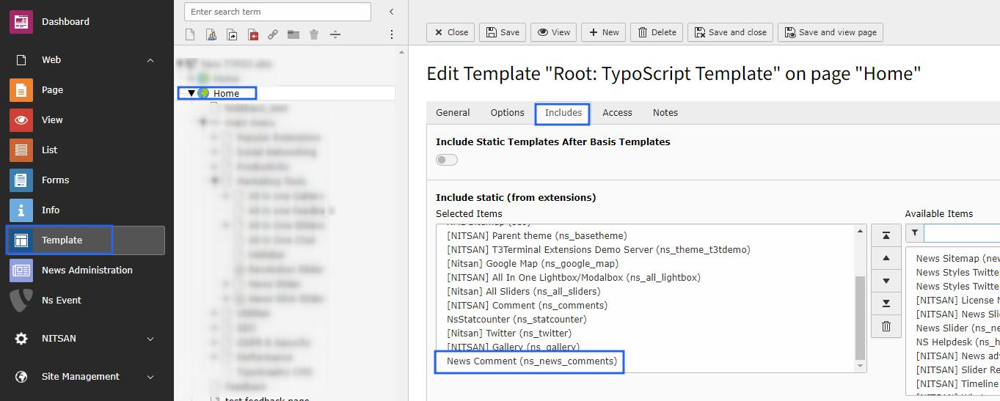

..  include:: /Includes.rst.txt

..  _installation:

============
Installation
============

Installing the ns_news_comments extension is straightforward. Follow the steps below to add the extension to your TYPO3 environment.

The extension currently supports TYPO3 v11, v12 and v13.

For Free Version
=================

Get the extension
-----------------

**Via Composer using Command Line**

The installation via composer is recommended.

..  code-block:: bash

    composer require nitsan/ns-news-comments --with-all-dependencies

**Via Extensions Module**

In the TYPO3 backend you can use the extension manager (EM).

1. Switch to the module "Extension Manager".
2. Get the extension
3. Get it from the Extension Manager: Press the "Retrieve/Update" button and search for the extension key ``ns_news_comments`` and import the extension from the repository.
4. Get it from typo3.org: You can always get the current version from https://extensions.typo3.org/extension/ns_news_comments/ by downloading either the t3x or zip version. Upload the file afterwards in the Extension Manager.

Activate the TypoScript
------------------------

The extension ships some static TypoScript code which needs to be included.

1. Switch to the root page of your site.
2. Switch to the Template/TypoScript module and select Info/Modify.
3. Click the link Edit the whole template record and switch to the tab Includes.
4. Select News Comment at the field Include static (from extensions).
5. Include News Comment at the last place.

For Premium Version - License Activation
=========================================

To activate license and install this premium TYPO3 product, please refer to this documentation: https://docs.t3planet.de/en/latest/License/Index.html

Video Tutorials
================

**Extension Installation Via without Composer mode**

https://www.youtube.com/watch?v=SN5HoFQcDM4

**Extension Via Composer**

https://www.youtube.com/watch?v=_7ILu4lwU-k