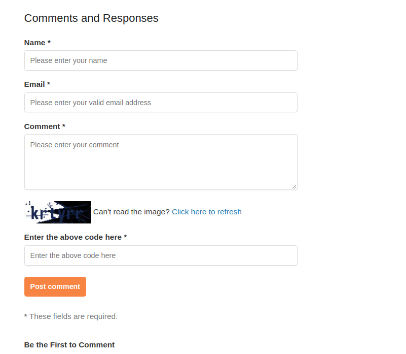
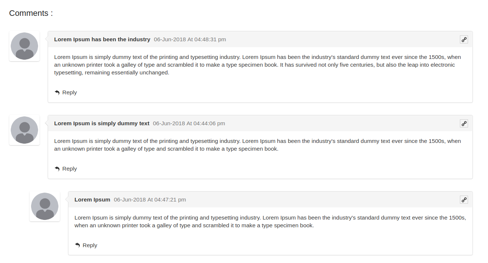
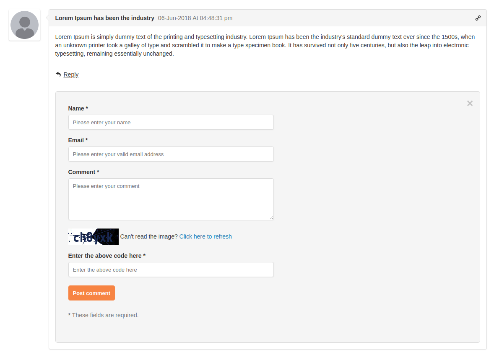
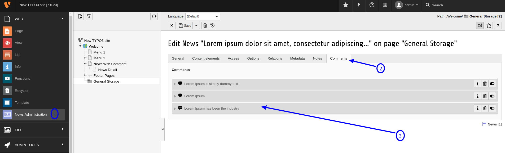
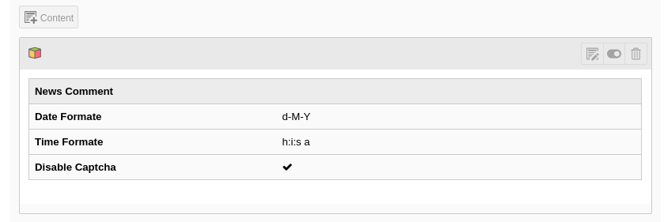


.. include:: ../Includes.txt

===================
General Information
===================

[NITSAN] Comment Plugin for EXT:news
====================================

.. _What-does-it-do:

What does it do?
================

This extension allows user to post comment on particular news, reply to the comments. This extension is compatible only with News system Extension (EXT:news).

**Features**

- Based on extbase & fluid.
- Easy to use.
- User can post comments on news.
- Captcha Verification.
- AJAX form submit.
- Responsive comments form and comment threads design.
- Multi-level (nested) comment threads
- Manage Comments from TYPO3 Backend
- Comment Approval by site Admin.
- Send notification to site admin by posting a new comment.
- Compatibiltiy from TYPO3 6.x to 9.x

.. danger::
   *A quote about EXT:ns_news_comments:* News comment extension going to be placed on detail page of the News. So, It is highly recommended to integrate News System Extension first. And configure this extension at News Detail page only.

.. _Screen-shots:

Screen Shots
================

1. News Comment Form
*********************

2. News Comments Listing
*************************

3. News Comment Reply Form
***************************

4. News Comment Listing At Backend
***********************************

5. News Comment Backend Plugin View
***********************************

